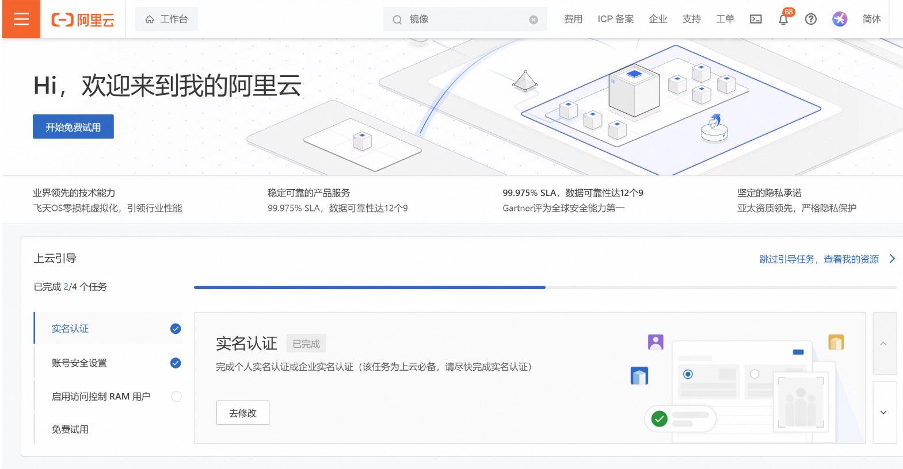
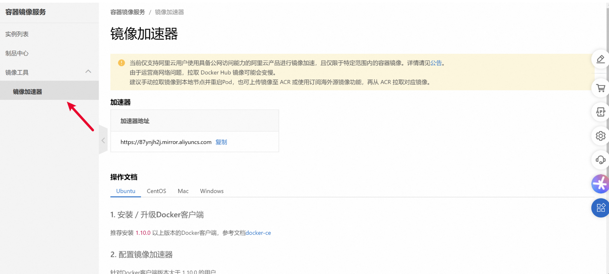

# Docker 基本组成

Docker主要由以下三个部分组成：镜像（Image）、容器（Container）和仓库（Repository）。


<br>

*** 

## Docker 镜像 (Image)

Docker 镜像是一个只读的模板，用于创建 Docker 容器。一个镜像可以创建许多容器。类似于 Java 中的类，容器则类似于 Java 中的对象。镜像是一种轻量级、可执行的独立软件包。

<br>

*** 

## Docker pull拉取镜像报错

我们安装docker 的时候尝试pull镜像的时候出现了这个报错

```shell
root@zbx-server:/etc/docker# docker pull hello-world
Using default tag: latest
Error response from daemon: Get "https://registry-1.docker.io/v2/": read tcp 192.168.20.200:37312->44.194.5.25:443: read: connection reset by peer
```


<br>

*** 


## 更换镜像源

1、**修改`/etc/docker/daemon.json`文件，没有的新建即可**

:::code-group
```sh [linux]
vim /etc/docker/daemon.json
```
:::

2、添加如下配置

:::code-group
```sh [linux]
{
    "registry-mirrors": [
    "https://2a6bf1988cb6428c877f723ec7530dbc.mirror.swr.myhuaweicloud.com",
    "https://docker.m.daocloud.io",
    "https://hub-mirror.c.163.com",
    "https://mirror.baidubce.com",
    "https://your_preferred_mirror",
    "https://dockerhub.icu",
    "https://docker.registry.cyou",
    "https://docker-cf.registry.cyou",
    "https://dockercf.jsdelivr.fyi",
    "https://docker.jsdelivr.fyi",
    "https://dockertest.jsdelivr.fyi",
    "https://mirror.aliyuncs.com",
    "https://dockerproxy.com",
    "https://mirror.baidubce.com",
    "https://docker.m.daocloud.io",
    "https://docker.nju.edu.cn",
    "https://docker.mirrors.sjtug.sjtu.edu.cn",
    "https://docker.mirrors.ustc.edu.cn",
    "https://mirror.iscas.ac.cn",
    "https://docker.rainbond.cc"
    ]
}

```
:::

<br>

3，加载配置文件，重启服务

:::code-group
```sh [linux]
root@zbx-server:/etc/docker# systemctl daemon-reload
root@zbx-server:/etc/docker# systemctl restart docker
```
:::


<sapn class="marker-evy"> 或者直接使用阿里云的镜像加速器</sapn>

首先，先注册好阿里云（地址：https://www.aliyun.com/）账号，已有账号的登录后，在阿里云控制台找到容器镜像服务



点击控制台，在里面搜索容器镜像服务



在/etc/docker/daemon.json配置好镜像加速


解决docker被重启了但是不会宕掉其他服务

:::code-group
```sh [linux]
#在/etc/docker/daemon.json里面添加
    ],
    "live-restore": true
```
:::

然后重启服务

:::code-group
```sh [linux]
sudo systemctl daemon-reload
sudo systemctl restart docker

```
:::

<br>

*** 

### Docker 容器 (Container)

Docker 容器是镜像的运行实例。容器运行一个或一组应用，提供一个标准化和隔离的运行环境。它们与镜像之间的关系就像 Java 中的类和实例对象：镜像是静态的定义，而容器是镜像运行时的实体。容器可以启动、停止、删除，并且是相互隔离的，确保安全。

### 仓库 (Repository)

仓库是集中存放镜像文件的地方，类似于 Maven 仓库。Docker 提供的官方仓库（Registry）称为 Docker Hub，存放各种镜像模板。仓库分为公开仓库（Public）和私有仓库（Private）。

### 总结

镜像文件可以看作是容器的模板，存放在仓库中。Docker 根据镜像模板创建容器实例，一个镜像模板可以创建多个容器实例。

<br>

*** 

## Docker 常用命令

### 帮助启动类命令

:::code-group
```sh [linux]
- 启动 Docker：`systemctl start docker`
- 停止 Docker：`systemctl stop docker`
- 重启 Docker：`systemctl restart docker`
- 查看 Docker 状态：`systemctl status docker`
- 开机启动：`systemctl enable docker`
- 查看 Docker 概要信息：`docker info`
- 查看 Docker 帮助文档：`docker --help`
- 查看 Docker 命令帮助文档：`docker <命令> --help`
```
:::

### 镜像命令

- 列出本地主机上的镜像：`docker images [OPTIONS]`
  - 选项：
    - `-a`：列出本地所有镜像
    - `-q`：只展示 IMAGE ID

- 搜索镜像：`docker search <镜像名>`

- 下载镜像：`docker pull <镜像名>[:TAG]`

- 查看镜像/容器/数据卷所占空间：`docker system df`

- 删除镜像：`docker rmi <镜像id>`

### 容器命令

- 新建并启动容器：`docker run [options] <image> [command][arg...]`
- 列出当前所有正在运行的容器：`docker ps [options]`
  - 选项：
    - `-a`：列出所有容器（包括历史）
    - `-l`：显示最近创建的容器
    - `-q`：静默模式，只显示容器ID

- 启动已停止的容器：`docker start <容器id或名称>`
- 重启容器：`docker restart <容器id或名称>`
- 停止容器：`docker stop <容器id或名称>`
- 强制停止容器：`docker kill <容器id或名称>`
- 删除已停止的容器：`docker rm <容器id>`

### 进入和管理容器

- 查看容器日志：`docker logs <容器id>`
- 查看容器内运行的进程：`docker top <容器id>`
- 查看容器内部细节：`docker inspect <容器id>`
- 进入正在运行的容器：`docker exec -it <容器id> bash`
- 从容器内拷贝文件到主机：`docker cp <容器id>:<容器内路径> <目的主机路径>`


<br>

*** 

## Docker 镜像详解

### UnionFS（联合文件系统）

Docker 镜像由一层层文件系统组成（UnionFS）。分层的好处是共享资源并便于复制迁移。多个镜像可以共享基础镜像，从而节省存储空间和内存。

### Docker 镜像分层

容器启动时，一个新的可写层会被加载到镜像顶部，称为“容器层”，下面的都是“镜像层”。镜像层是只读的，容器层是可写的。

### Docker 镜像的创建和提交

- 提交容器副本为新镜像：`docker commit -m "描述" -a "作者" <容器ID> <目标镜像名:标签>`

### Docker 数据卷

### 运行带数据卷的容器

- 运行命令：`docker run -it --privileged=true -v /宿主机路径:/容器路径 <镜像>|<镜像id>`

### 数据卷的读写规则

- 读写（默认）：`-v /宿主机路径:/容器路径:rw`
- 只读：`-v /宿主机路径:/容器路径:r`

### 数据卷的继承和共享

- 继承数据卷：`docker run -it --volumes-from <父容器> <镜像>|<镜像id>`

### 安装和配置示例

### Docker 下安装 MySQL

1. 下载 MySQL 镜像：`docker pull mysql:8.0.33`
2. 启动容器：

:::code-group
```sh [linux]
   docker run -d -p 3306:3306 --privileged=true \
   -v /opt/app/mysql/log:/var/log/mysql \
   -v /opt/app/mysql/data:/var/lib/mysql \
   -v /opt/app/mysql/conf:/etc/mysql/conf.d \
   --restart=always \
   -e MYSQL_ROOT_PASSWORD=abc123 --name mysql8 mysql:8.0.33 --lower-case-table-names=1
```
:::

3. 在 `/opt/app/mysql/conf` 下创建 `my.cnf`，并写入配置。

### Docker 下安装 Redis

1. 拉取 Redis 镜像：`docker pull redis:latest`
2. 启动容器：

:::code-group
```sh [linux]
   docker run -p 6379:6379 --name=myredis --privileged=true \
   -v /opt/app/redis/redis.conf:/etc/redis/redis.conf \
   -v /opt/app/redis/data:/data \
   -d redis:latest redis-server /etc/redis/redis.conf
```
:::

### Docker 下安装 Nacos

1. 创建 MySQL 数据库 `nacos_config`。
2. 获取 Nacos 配置文件，将容器内配置文件复制到宿主机。
3. 修改 `application.properties`，配置数据库连接。
4. 启动 Nacos 容器：

:::code-group
```sh [linux]
   docker run -d \
   -e MODE=standalone \
   -p 8848:8848 \
   -v /develop_env/nacos/conf:/home/nacos/conf \
   -v /develop_env/nacos/logs:/home/nacos/logs \
   -v /develop_env/nacos/data:/home/nacos/data \
   --name nacos \
   --restart=always \
   nacos/nacos-server:1.4.1
```
:::
访问 `http://<your-ip>:8848/nacos` 查看 Nacos 控制台。

