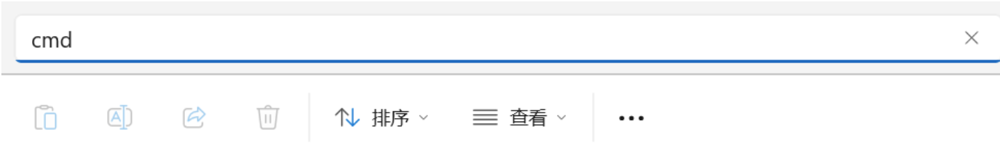
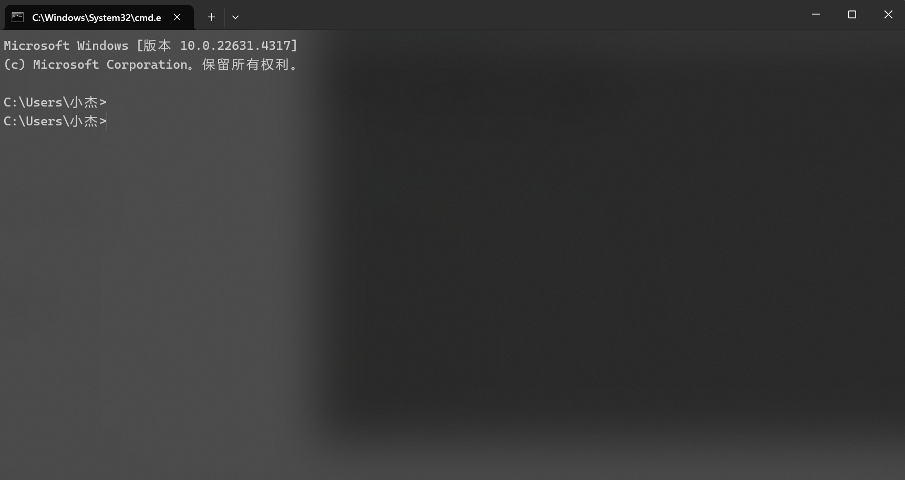

## VitePress搭建并部署网站


## 前言


### 使用开源项目版本的注意事项

**首先，明确一点：不要轻易使用最新的版本！**  
很多开源项目的文档写得过于简练，不太适合初学者。建议提供一个常见问题解答（QA）区域，以便新手查找帮助。

当我们遇到问题时，通常有以下三种解决方案：

1. **在线搜索**：查看别人写的博客或论坛帖子。
2. **询问GPT**：利用AI获取快速解答。
3. **请教他人**：这种方式效率最低，特别是对于不会提问的朋友来说。

向他人请教问题之前，建议先自我总结并整理好思路，包括遇到的问题、采取的措施以及所做的努力。

对于开源项目，额外还有两条建议：

1. **查看GitHub的issues区**：看看是否有人遇到过类似问题。
2. **提交issue**：向项目维护者报告你的问题。

<br>

*** 
### 为什么不建议使用最新版本？

1. **解决方案稀缺**：最新版本可能在网上没有解决方案，特别是对于小众的开源项目。
2. **GPT知识更新滞后**：问GPT时，它的知识库可能未更新到最新版本，因此无法提供相关解决方案。
3. **GitHub的issue区**：只能碰运气，不能保证找到有效的答案。

总之，使用稳定版本能减少不必要的麻烦和困扰。

<br>

*** 

## 安装

### 安装依赖

在项目目录上方的地址栏，上输入 `cmd` 回车可以快捷打开（最好是建一个新的文档来存放）







**第二种方式**

首先，选择一个合适的位置创建你的项目目录，以`pnpm` 为例，初始化 `package.json`

:::code-group
```sh [window]
mkdir vitepress-blog && cd vitepress-blog && pnpm init
```
:::
**安装 VitePress 生成项目**

利用下面命令安装`vitePress`, 安装完成后，利用 VitePress 附带一个命令行设置向导，帮助我们快速构建一个基本项目。

:::code-group
```sh [pnpm]
pnpm add -D vitepress
#通过运行以下命令启动向导
pnpm vitepress init
```
:::

<br>

*** 

### 开始初始化向导


:::code-group
```sh [pnpm]
pnpm add -D vitepress
```
:::


:::code-group
```sh
T   Welcome to VitePress!
|
o  Where should VitePress initialize the config?
|  ./docs
|
o  Site title:
|  My Awesome Project
|
o  Site description:
|  A VitePress Site
|
o  Theme:
|  Default Theme
|
o  Use TypeScript for config and theme files?
|  Yes
|
o  Add VitePress npm scripts to package.json?
|  Yes
|
—  Done! Now run npm run docs:dev and start writing.
```
:::

到这里的话我们初始化就已经完成啦！

<br>

*** 

### 启动

通过本地启动开发环境，来开发你的网站


:::code-group
```sh [pnpm]

pnpm run docs:dev
```
:::

他会生成了一个本地 `5173` 端口的链接，复制到浏览器打开进行预览

:::code-group
```sh [pnpm]
  vitepress v1.5.0

  ➜  Local:   http://localhost:5173/
  ➜  Network: use --host to expose
  ➜  press h to show help
16:37:23 [vitepress] .vitepress\config.mjs changed, restarting server...

```
:::


<br>

*** 


## 调整配置


到此我们就会得到一个目录

:::code-group
```sh 
.
├─ docs
│  ├─ .vitepress
│  │  └─ config.mts          <-- 配置文件已由ts变成mts
│  ├─ api-examples.md        <-- 文章1
│  ├─ markdown-examples.md   <-- 文章2
│  ├─ guide                  <-- 新增目录
│  │   └─ index.md           <-- 新增目录的首页
│  └─ index.md               <-- 首页
└─ package.json
└── pnpm-lock.yaml
```
:::

:::code-group
```sh 
// 从 'vitepress' 模块导入 defineConfig 函数
import { defineConfig } from 'vitepress'

// 使用 defineConfig 函数来定义网站的配置
// 这里的配置对象将被用于设置 VitePress 网站的各个方面
export default defineConfig({
  // 网站的标题，将显示在浏览器标签页上
  title: "My Awesome Project",
  
  // 网站的描述，通常用于 SEO 和社交媒体分享
  description: "A VitePress Site",
  
  // themeConfig 属性用于配置网站的主题相关设置
  themeConfig: {
    // 导航栏配置，设置网站的主要链接
    nav: [
      { text: 'Home', link: '/' }, // 主导航链接，指向首页
      { text: 'Examples', link: '/markdown-examples' } // 指向示例页面的链接
    ],

    // sidebar 属性用于配置侧边栏内容
    sidebar: [
      {
        text: 'Examples', // 侧边栏的标题
        items: [ // 侧边栏中的链接项
          { text: 'Markdown Examples', link: '/markdown-examples' }, // 指向 Markdown 示例页面的链接
          { text: 'Runtime API Examples', link: '/api-examples' } // 指向运行时 API 示例页面的链接
        ]
      }
    ],

    // 社交链接，用于连接到社交媒体账号
    socialLinks: [
      { icon: 'github', link: 'https://github.com/vuejs/vitepress' } // GitHub 链接，指向 VitePress 的 GitHub 页面
    ]
  }
})


```
:::

<br>

*** 

### logo设置

在目录新建public文件夹，并在 `.\public` 中 放入logo
:::code-group
```sh 
export default defineConfig({

  themeConfig: {
    //左上角logo
    logo: '/logo.png',
  },

})
```
:::

<br>

*** 


### 行号显示

:::code-group
```sh [config.mjs]
export default defineConfig({
  //markdown配置
  markdown: {
    //行号显示
    lineNumbers: true, //false关闭
  },
})
```
:::
如果你在某个代码块不想使用，可以通过 `ts:no-line-numbers` 来临时关闭


<br>

*** 


### 导航栏

一个基础的导航，首页、文章路径以及外站链接，我这里加了个下拉式菜单导航，就需要加一个iteams
:::code-group
```sh 
export default defineConfig({

  themeConfig: {
    //导航栏
 nav: [
      { text: '导航', link: '/' },
      {
        text: '小小前端',
        items: [
          {
            text: 'VitePress搭建并部署网站',
            link: "/leading/index.md"
          }
        ]
      },

})
```
:::

要为下拉菜单添加分组标题，需要再次嵌套 `items`。

:::code-group
```sh [config.mjs]
export default defineConfig({

  themeConfig: {
    //导航栏
    nav: [
      { text: '导航', link: '/' },
      {
        text: '小小前端',
        items: [
          {
            // 分组标题1
            text: '介绍',
            items: [
              { text: '前言', link: '/preface' },
            ],
          },
          {
            // 分组标题2
            text: '基础设置',
            items: [
              { text: '快速上手', link: '/getting-started' },
              { text: '配置', link: '/configuration' },
              { text: '页面', link: '/page' },
              { text: 'Frontmatter', link: '/frontmatter' },
            ],
          },
          {
            // 分组标题3
            text: '进阶玩法',
            items: [
              { text: 'Markdown', link: '/Markdown' },
              { text: '静态部署', link: '/assets' },
            ],
          },
        ],
      },
      { text: 'VitePress', link: 'https://vitepress.dev/' },
    ],
  },

})
```
::: 

### 底部配置

这个是直接配置footer，在`config.mjs defineConfig themeConfig`下面配置就可以了

:::code-group
```sh [config.mjs]
    footer:{
        copyright:"Copyright @ 2024 longlong",
        },
```
:::


<br>

*** 


### 修改 vitePress 默认的主题样式

打开 `.vitepress/theme/style.css` 文件，您可以在其中修改主题的颜色。如果需要查找配色方案，可以访问这个网站：[www.eggradients.com](https://www.eggradients.com/)。在找到合适的配色后，您可以替换 `style.css` 中的颜色变量。我这里就选了个我自己喜欢的颜色配置示例：

:::code-group
```sh [style.css]
:root {
  --vp-c-brand-1: #5e3af2;
  --vp-c-brand-2: #694aea;
  --vp-c-brand-3: #7759f1;
}

.dark {
  --vp-c-brand-1: #9b85f5;
  --vp-c-brand-2: #7759f1;
  --vp-c-brand-3: #615ced;
}

:root {
  /* hero标题渐变色 */
  --vp-home-hero-name-color: transparent;
  --vp-home-hero-name-background: -webkit-linear-gradient(
    120deg,
    #5e3af2,
    #00f6c0
  );

  /*hero logo背景渐变色 */
  --vp-home-hero-image-background-image: linear-gradient(
    -45deg,
    #5f3af2c8 50%,
    #47cbff7e 50%
  );
  --vp-home-hero-image-filter: blur(76px);
}
:::

### 修改首页

要修改首页展示的内容，请编辑 `/docs/index.md` 文件。首页的内容结构总体分为三层：

1. **layout**：首页的布局，默认设置为 `home`。
2. **hero**：首页上方的展示区域配置。
3. **features**：首页下方区域的卡片配置。

以下是一份简单的配置示例：
:::code-group
```sh [pnpm]
---
# https://vitepress.dev/reference/default-theme-home-page
layout: home


hero:
  name: "龙龙物语"
  text: "long long的成长之路"
  tagline: 永远相信美好的事情即将发生！
  image:
    src: /avatar.png
    alt: 背景图片
  actions:
    - theme: brand
      text: 日常笔记
      link: /markdown-examples
    - theme: alt
      text: 关于我
      link: /api-examples

features:
  - icon: 🐞
    title: 小建议
    details: 选择永远大于努力 
  - icon: 📖
    title: 努力
    details: 如果决定了做一件事情就努力把他做好
  - icon: 💡
    title: 思考
    details: 做事情之前不妨先静下心来思考，不要人云亦云
---

```
:::

<br>

*** 

### 社交链接

可以自行添加，支持SVG

:::code-group
```sh [config.mjs]
export default defineConfig({

  themeConfig: {
    //社交链接
    socialLinks: [ 
      { icon: 'github', link: 'https://github.com/longlong-2002' }, 
      { icon: 'twitter', link: 'https://twitter.com/' }, 
    ], 
  },

})
```
:::

<br>

*** 

### 链接

在Markdown中，可以使用特定格式创建内部和外部链接。内部链接用于引用同一文档中的特定部分，而外部链接则指向其他网站。以下是一些示例：

#### 内部链接示例

要创建指向文档内部的链接，可以使用以下格式

:::code-group
```sh 
[点我跳转：book文章中的大纲](./book.html#大纲)
```
:::


#### 外部链接示例

对于外部链接，可以使用以下格式：

:::code-group
```sh
* [vuejs.org](https://vuejs.org/)
* [GitHub 上的 VitePress](https://github.com/vuejs/vitepress)
```
:::


### 图片的懒加载

开启图片懒加载可以显著提升访问体验，强烈推荐使用。

#### 区别

**不开启懒加载**：网页上的所有图片会一次性加载，随着图片数量增加，加载速度会变得越来越慢。

**开启懒加载**：网页加载速度更快，只有当用户滚动到图片位置时，相关图片才会加载，从而提升整体访问体验。

在`config.mjs`文件里面添加
:::code-group
```sh [config.mjs]
 export default defineConfig({  //markdown配置  markdown: {    image: {      // 开启图片懒加载      lazyLoading: true    },  },})

```
:::

<br>

*** 


## 搜索框

### 设置搜索框

在`config.mjs defineConfig themeConfig`下面直接配置即可

:::code-group
```sh [config.mjs]
   // 设置搜索框的样式
    search: {
      provider: "local",
      options: {
        translations: {
          button: {
            buttonText: "搜索文档",
            buttonAriaLabel: "搜索文档",
          },
          modal: {
            noResultsText: "无法找到相关结果",
            resetButtonTitle: "清除查询条件",
            footer: {
              selectText: "选择",
              navigateText: "切换",
            },
          },
        },
      },
    },

```
:::

<br>

*** 

### 导航栏添加毛玻璃效果

更改搜索框的位置，修改代码块，给导航栏添加毛玻璃等效果

修改`.vitepress/theme/style.css`文件：

:::code-group
```sh [style.css]
:root {
  --vp-c-brand-1: #5e3af2;
  --vp-c-brand-2: #694aea;
  --vp-c-brand-3: #7759f1;

  --vp-custom-block-info: #cccccc;
  --vp-custom-block-info-bg: #fdfdfe;

  --vp-custom-block-tip: #009400;
  --vp-custom-block-tip-bg: #e6f6e6;

  --vp-custom-block-warning: #e6a700;
  --vp-custom-block-warning-bg: #fff8e6;

  --vp-custom-block-danger: #e13238;
  --vp-custom-block-danger-bg: #ffebec;

  --vp-custom-block-note: #4cb3d4;
  --vp-custom-block-note-bg: #eef9fd;

  --vp-custom-block-important: #a371f7;
  --vp-custom-block-important-bg: #f4eefe;
  /* hero标题渐变色 */
  --vp-home-hero-name-color: transparent;
  --vp-home-hero-name-background: -webkit-linear-gradient(
    120deg,
    #5e3af2,
    #00f6c0
  );

  /*hero logo背景渐变色 */
  --vp-home-hero-image-background-image: linear-gradient(
    -45deg,
    #5f3af2c8 50%,
    #47cbff7e 50%
  );
  --vp-home-hero-image-filter: blur(76px);
}

.dark {
  --vp-custom-block-info: #cccccc;
  --vp-custom-block-info-bg: #474748;

  --vp-custom-block-tip: #009400;
  --vp-custom-block-tip-bg: #003100;

  --vp-custom-block-warning: #e6a700;
  --vp-custom-block-warning-bg: #4d3800;

  --vp-custom-block-danger: #e13238;
  --vp-custom-block-danger-bg: #4b1113;

  --vp-custom-block-note: #4cb3d4;
  --vp-custom-block-note-bg: #193c47;

  --vp-custom-block-important: #a371f7;
  --vp-custom-block-important-bg: #230555;

  --vp-c-brand-1: #9b85f5;
  --vp-c-brand-2: #7759f1;
  --vp-c-brand-3: #615ced;
}

/* 标题字体大小 */
.custom-block-title {
  font-size: 16px;
}

/* 注释容器:背景色、左侧 */
.custom-block.info {
  background-color: var(--vp-custom-block-info-bg);
  border-left: 5px solid var(--vp-custom-block-info);
}

/* 提示容器:边框色、背景色、左侧 */
.custom-block.tip {
  /* border-color: var(--vp-custom-block-tip); */
  background-color: var(--vp-custom-block-tip-bg);
  border-left: 5px solid var(--vp-custom-block-tip);
}

/* 警告容器:背景色、左侧 */
.custom-block.warning {
  background-color: var(--vp-custom-block-warning-bg);
  border-left: 5px solid var(--vp-custom-block-warning);
}

/* 危险容器:背景色、左侧 */
.custom-block.danger {
  background-color: var(--vp-custom-block-danger-bg);
  border-left: 5px solid var(--vp-custom-block-danger);
}

/* NOTE容器:背景色、左侧 */
.custom-block.note {
  background-color: var(--vp-custom-block-note-bg);
  border-left: 5px solid var(--vp-custom-block-note);
}

/* IMPORTANT容器:背景色、左侧 */
.custom-block.important {
  background-color: var(--vp-custom-block-important-bg);
  border-left: 5px solid var(--vp-custom-block-important);
}

/* CAUTION容器:背景色、左侧 */
.custom-block.caution {
  background-color: var(--vp-c-red-soft);
  border-left: 5px solid var(--vp-c-red-3);
}

/* 侧边栏 */
.group:has([role="button"]) .VPSidebarItem.level-0 .items {
  padding-left: 16px !important;
  border-radius: 2px;
  transition: background-color 0.25s;
}

/* 搜索框的位置 */
.VPNavBarSearch.search {
  justify-content: flex-end !important;
  padding-right: 32px !important;
}

.vp-doc blockquote {
  border-left: 4px solid var(--vp-c-divider);
}

/* .vitepress/theme/style/blur.css */
:root {
  /* 首页导航 */
  .VPNavBar {
    background-color: rgba(255, 255, 255, 0);
    backdrop-filter: blur(10px);
  }

  /* 文档页导航两侧 */
  .VPNavBar:not(.home) {
    background-color: rgba(255, 255, 255, 0);
    backdrop-filter: blur(10px);
  }

  @media (min-width: 960px) {
    /* 文档页导航两侧 */
    .VPNavBar:not(.home) {
      background-color: rgba(255, 255, 255, 0);
      backdrop-filter: blur(10px);
    }

    /* 首页下滑后导航两侧 */
    .VPNavBar:not(.has-sidebar):not(.home.top) {
      background-color: rgba(255, 255, 255, 0);
      backdrop-filter: blur(10px);
    }
  }

  @media (min-width: 960px) {
    /* 文档页导航中间 */
    .VPNavBar:not(.home.top) .content-body {
      background-color: rgba(255, 255, 255, 0);
      backdrop-filter: blur(10px);
    }

    /* 首页下滑后导航中间 */
    .VPNavBar:not(.has-sidebar):not(.home.top) .content-body {
      background-color: rgba(255, 255, 255, 0);
      backdrop-filter: blur(10px);
    }
  }

  /* 分割线 */

  @media (min-width: 960px) {
    /* 文档页分割线 */
    .VPNavBar:not(.home.top) .divider-line {
      background-color: rgba(255, 255, 255, 0);
      backdrop-filter: blur(10px);
    }

    /* 首页分割线 */
    .VPNavBar:not(.has-sidebar):not(.home.top) .divider {
      background-color: rgba(255, 255, 255, 0);
      backdrop-filter: blur(10px);
    }
  }

  /* 搜索框 VPNavBarSearchButton.vue */
  .DocSearch-Button {
    background-color: rgba(255, 255, 255, 0);
    backdrop-filter: blur(10px);
  }

  /* 移动端大纲栏 */
  .VPLocalNav {
    background-color: rgba(255, 255, 255, 0);
    backdrop-filter: blur(10px);
    /* 隐藏分割线 */
    /* border-bottom: 5px solid var(--vp-c-gutter); */
    border-bottom: 0px;
  }
}

/* .vitepress/theme/style/vp-code-group.css */

/* 代码块tab */
.vp-code-group .tabs {
  padding-top: 30px;
}

/* 代码块tab-顶部小圆点 */
.vp-code-group .tabs::before {
  background: #fc625d;
  border-radius: 50%;
  box-shadow: 20px 0 #fdbc40, 40px 0 #35cd4b;
  content: " ";
  height: 12px;
  width: 12px;
  left: 12px;
  margin-top: -15px;
  position: absolute;
}

/* 代码组 */
.vp-code-group {
  color: var(--vp-c-black-soft);
  border-radius: 8px;
  box-shadow: 0 10px 30px 0 rgb(0 0 0 / 40%);
}
:::
最后引入 style.css 中 即可看到效果
:::code-group
```sh [style.css]
/* style/index.css */
@import './blur.css';
```
:::

<br>

*** 

## 侧边栏设置

最简单的形式是传递单个链接，但这样非常单调，我们可以使用 `items` 分组


### 常用设置

`text` 文字可以自定义，`link` 填写文章路径时无需添加 `.md` 后缀
:::code-group
```sh [config.mjs]
    sidebar: {
      // 目录1
      '/leading/': [
        {
          text: '前端',
          items: [
            { text: 'Index', link: '/guide/' },
            { text: 'One', link: '/guide/one' },
            { text: 'Two', link: '/guide/two' }
          ],
        },
      ],
```
:::


多个侧边栏样式，那么我们的配置就是
:::code-group
```sh [config.mjs]
      sidebar: {
      // 目录1
      '/leading/': [
        {
          text: '前端',
          items: [
            { text: 'Index', link: '/guide/' },
            { text: 'One', link: '/guide/one' },
            { text: 'Two', link: '/guide/two' }
          ],
        },
      ],

      // 目录2
      '/about/': [
        {
          text: '关于我',
          //侧边栏折叠
          collapsed: false,
          items: [
            { text: '所思所想', link: '/about/think.md' },
            { text: '自律篇', link: '/about/promise.md' },
            { text: 'Four', link: '/config/four' }
          ],
        },
      ],
    },
```
:::

<br>


多个侧边栏也是可以的，有其他目录可以参考官方的目录表样式
:::code-group
```sh 
.
├─ guide/
│  ├─ index.md
│  ├─ one.md
│  └─ two.md
└─ config/
   ├─ index.md
   ├─ three.md
   └─ four.md
```
:::

### 上下页

这个配置他默认从侧边栏配置中读取

:::code-group
```sh [config.mjs]
    export default defineConfig({

  themeConfig: {
    //自定义上下页名
    docFooter: { 
      prev: '上一页', 
      next: '下一页', 
    }, 
  },

})
```
:::

<br>

*** 

## 其他美化

### 代码组

将代码组改成Mac风格，三个小圆点

在 `.vitepress/theme 目录新建一个 `vp-code-group.css 文件

复制下面代码，粘贴到 `vp-code-group.css` 保存
:::code-group
```sh [vp-code-group.css]
/* .vitepress/theme/style/vp-code-group.css */

/* 代码组：tab间距 */
.vp-code-group .tabs {
  padding-top: 20px;
}

/* 代码组：添加样式及阴影 */
.vp-code-group {
  color: var(--vp-c-black-soft);
  border-radius: 8px;
  box-shadow: 0 10px 30px 0 rgb(0 0 0 / 40%);
}

/* 代码组：添加macOS风格的小圆点 */
.vp-code-group .tabs::before {
  content: ' ';
  position: absolute;
  top: 20px;
  left: 12px;
  height: 12px;
  width: 12px;
  background: #fc625d;
  border-radius: 50%;
  box-shadow: 20px 0 #fdbc40, 40px 0 #35cd4b;
}


/* 代码组：修正倒角、阴影、边距 */
.vp-code-group div[class*="language-"].vp-adaptive-theme.line-numbers-mode {
  border-radius: 8px;
  box-shadow: none;
  padding-top: 0px;
}

/* 代码组：隐藏小圆点 */
.vp-code-group div[class*="language-"].vp-adaptive-theme.line-numbers-mode::before {
  display: none;
}

/* 代码组：修正行号位置 */
.vp-code-group .line-numbers-mode .line-numbers-wrapper {
  padding-top: 20px;
}

/* 代码组：修正行号右侧竖线位置 */
.vp-code-group .line-numbers-mode .line-numbers-wrapper::after {
  top: 24px;
}


/* 代码组（无行号）：修正倒角、阴影、边距 */
.vp-code-group div[class*="language-"].vp-adaptive-theme {
  border-radius: 8px;
  box-shadow: none;
  padding-top: 0px;
}

/* 代码组（无行号）：隐藏小圆点 */
.vp-code-group div[class*="language-"].vp-adaptive-theme::before {
  display: none;
}
```
:::

<br>

*** 

### 代码块

将代码组改成Mac风格，三个小圆点

在 `.vitepress/theme` 目录新建一个 `vp-code.css` 文件

:::code-group
```sh 
.
├─ docs
│  ├─ .vitepress
│  │  └─ config.mts
│  │  └─ theme
│  │     └─ style
│  │        └─ index.css
│  │        └─ vp-code.css
│  └─ index.md
└─ node_modules
:::

复制下面代码，粘贴到 `vp-code.css` 保存
:::code-group
```sh [vp-code.css]
/* .vitepress/theme/vp-code.css */

/* 代码块：增加留空边距 增加阴影 */
.vp-doc div[class*=language-] {
  box-shadow: 0 10px 30px 0 rgb(0 0 0 / 40%);
  padding-top: 20px;
}

/* 代码块：添加macOS风格的小圆点 */
.vp-doc div[class*=language-]::before {
  content: "";
  display: block;
  position: absolute;
  top: 12px;
  left: 12px;
  width: 12px;
  height: 12px;
  background-color: #ff5f56;
  border-radius: 50%;
  box-shadow: 20px 0 0 #ffbd2e, 40px 0 0 #27c93f;
  z-index: 1;
}

/* 代码块：下移行号 隐藏右侧竖线 */
.vp-doc .line-numbers-wrapper {
  padding-top: 40px;
  border-right: none;
}

/* 代码块：重建行号右侧竖线 */
.vp-doc .line-numbers-wrapper::after {
  content: "";
  position: absolute;
  top: 40px;
  right: 0;
  border-right: 1px solid var(--vp-code-block-divider-color);
  height: calc(100% - 60px);
}
:::
然后在 `style.css` 中引入生效
:::code-group
```sh [config.mjs]

@import './vp-code.css';
```
:::

然后在 `index.css` 中引入生效
:::code-group
```sh [index.css]
/* .vitepress/theme/style/index.css */
@import './vp-code.css';
```
:::

输入
````
```sh
#默认有行号
pnpm -v
```

```sh:no-line-numbers
#关闭行号
pnpm -v
```
````


## 项目部署

> 更新时间：2024年